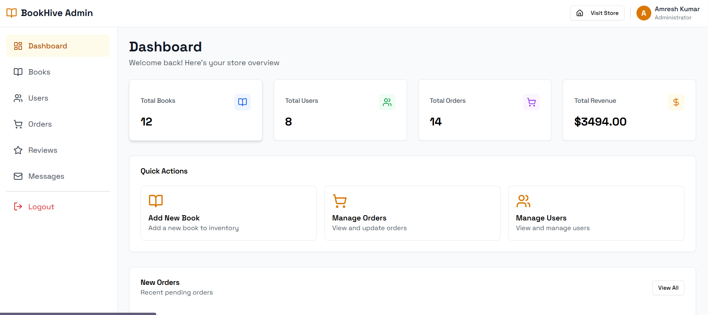
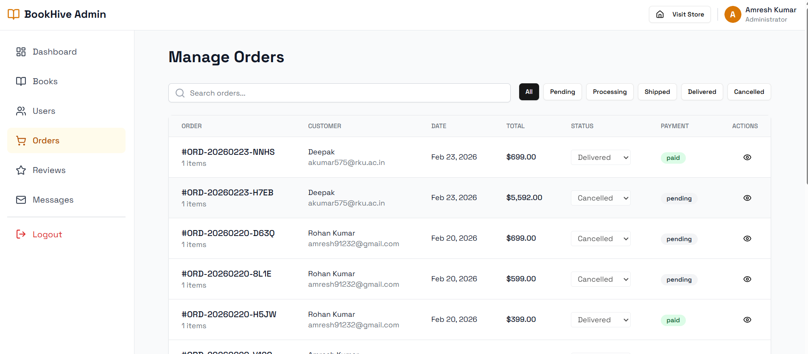
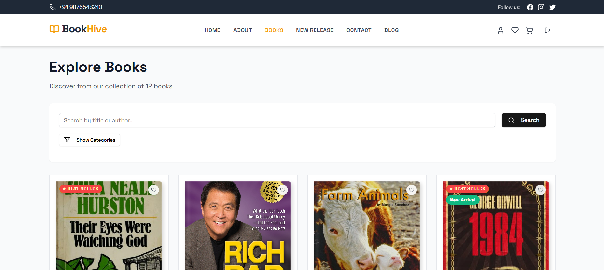

# BookHive Online Book Store

BookHive is a full-stack ecommerce application for browsing, buying, and managing books with a dedicated admin dashboard.

Live Demo: https://book-hive-online-book-store.vercel.app/

## Screenshots





## Features
User Features
- Browse and search books
- Category filters and book details
- Wishlist and cart management
- Secure checkout and order tracking
- OTP-based registration and JWT login
- Profile management and password reset

Admin Features
- Dashboard overview
- Manage books, users, and orders
- Update order and payment status
- Moderate reviews
- View and delete customer messages

## Tech Stack
- React 18, Vite, Redux Toolkit
- Tailwind CSS, Shadcn UI, Lucide Icons
- Node.js, Express, MongoDB (Mongoose)
- JWT authentication, OTP via email
- Cloudinary for media uploads

## Project Structure
```
BookHive_online_book_store/
- frontend/
- backend/
- vercel.json
```

## Getting Started
Prerequisites
- Node.js 16+ and npm

Setup
1. Install dependencies
```
cd backend
npm install
cd ../frontend
npm install
```

2. Configure environment variables
Frontend: create `frontend/.env`
```
VITE_API_URL=https://your-backend-domain.com
```

Backend: create `backend/.env`
```
PORT=5000
MONGO_URI=your_mongodb_uri
JWT_SECRET=your_jwt_secret
CLOUDINARY_CLOUD_NAME=your_cloud_name
CLOUDINARY_API_KEY=your_cloudinary_key
CLOUDINARY_API_SECRET=your_cloudinary_secret
EMAIL_USER=your_email
EMAIL_PASS=your_email_app_password
CLIENT_ORIGIN=https://book-hive-online-book-store.vercel.app
```

3. Run the apps
```
cd backend
npm run dev
cd ../frontend
npm run dev
```

## Deployment
Frontend (Vercel)
- Set `VITE_API_URL` to your backend URL
- Build command: `npm run build`
- Output directory: `frontend/dist`

Backend (Render or similar)
- Set `CLIENT_ORIGIN` to your Vercel domain
- Start command: `npm start`

## License
MIT
